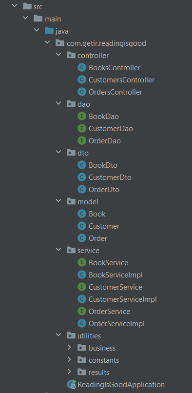

# **ReadingIsGood**

ReadingIsGood is an online books retail firm which operates only on the Internet. Main
target of ReadingIsGood is to deliver books from its one centralized warehouse to their
customers within the same day. That is why stock consistency is the first priority for their
vision operations.

**TECHOLOGY STACK** 

- Java 8
- Spring Boot
- Swagger
- Apache Maven
- Spring Data JPA
- ModelMapper
- PostgreSQL
- IntelliJ IDEA

**PROJECT STRUCTURE**

**APPLICATION COMPONENTS**
- BooksController
- CustomersController
- OrdersController

**PROJECT SETUP**

- git clone https://github.com/zeynep-kesim/ReadingIsGood
- run ReadingIsGoodApplication class

**API DOCUMENTATION**

- http://localhost:8080/swagger-ui.html#/